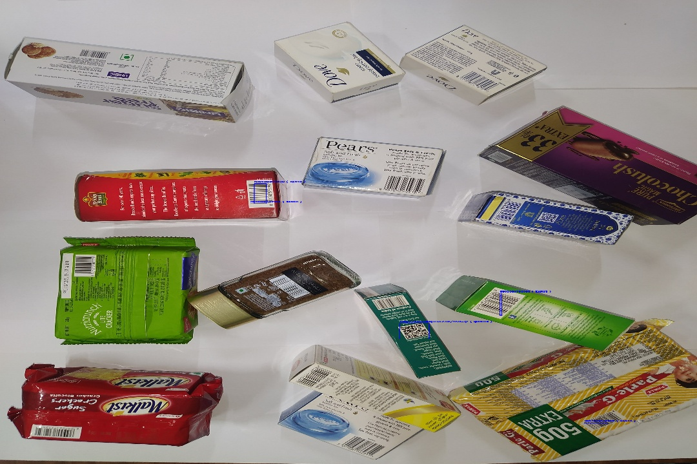
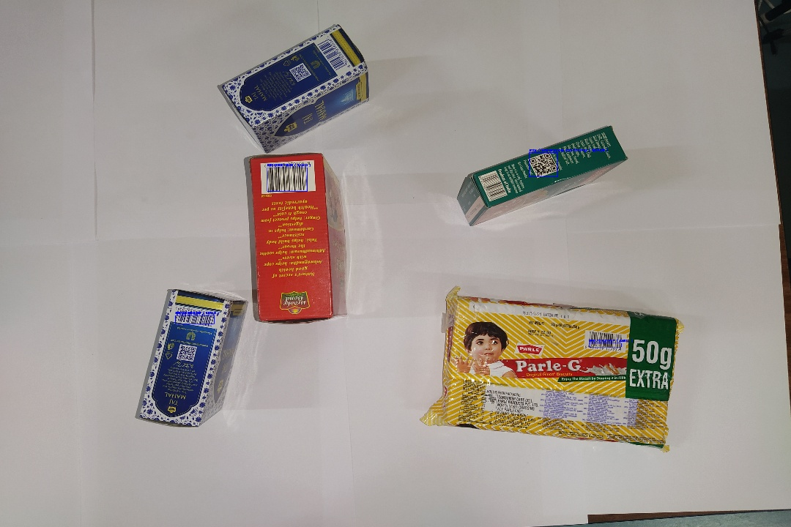
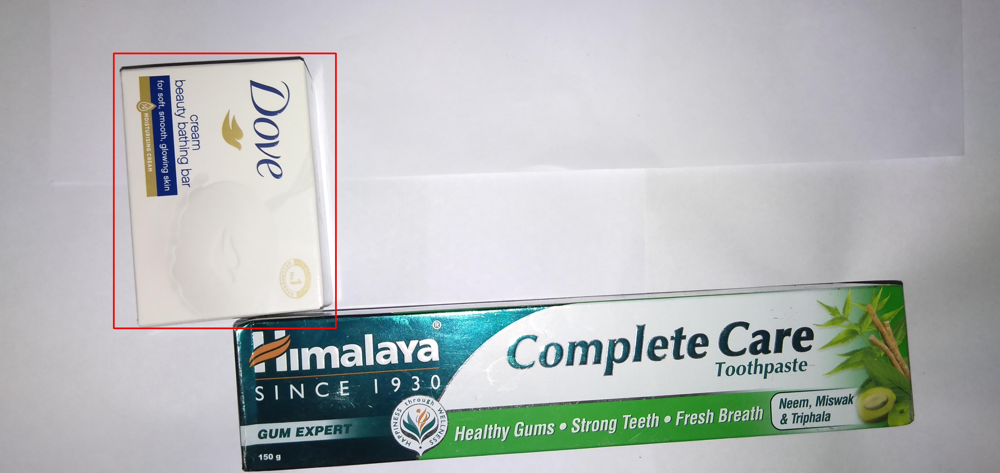
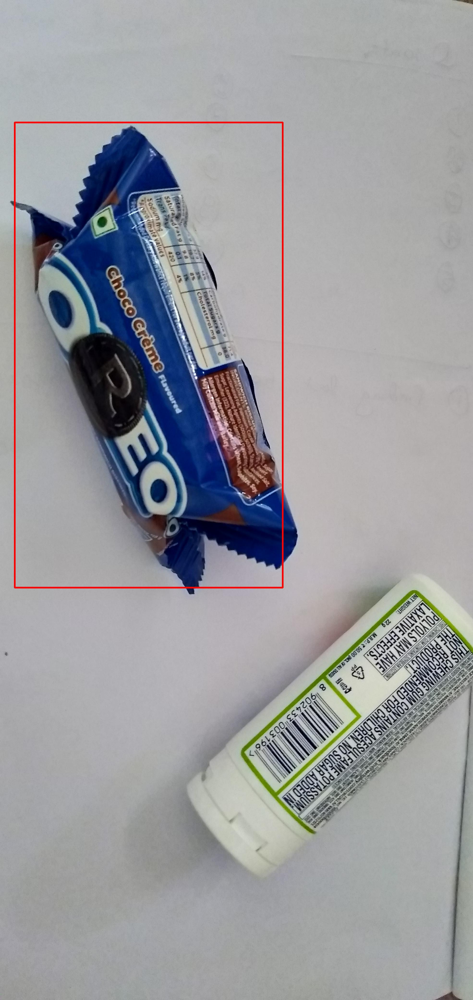
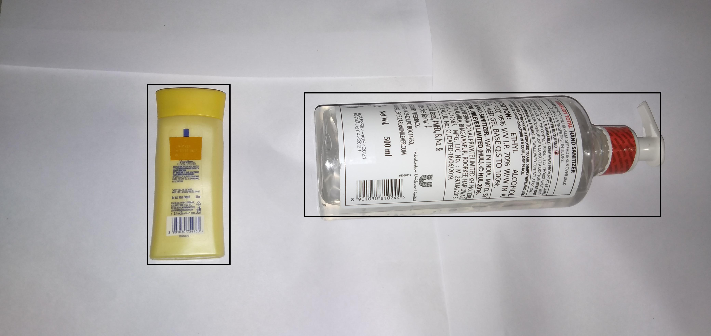
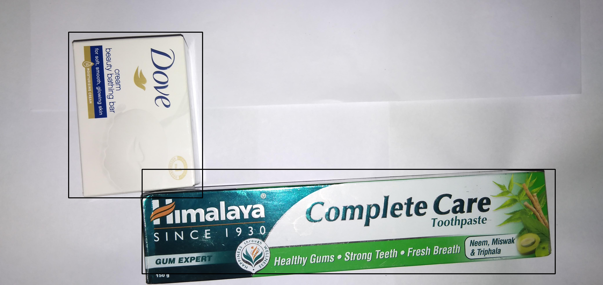
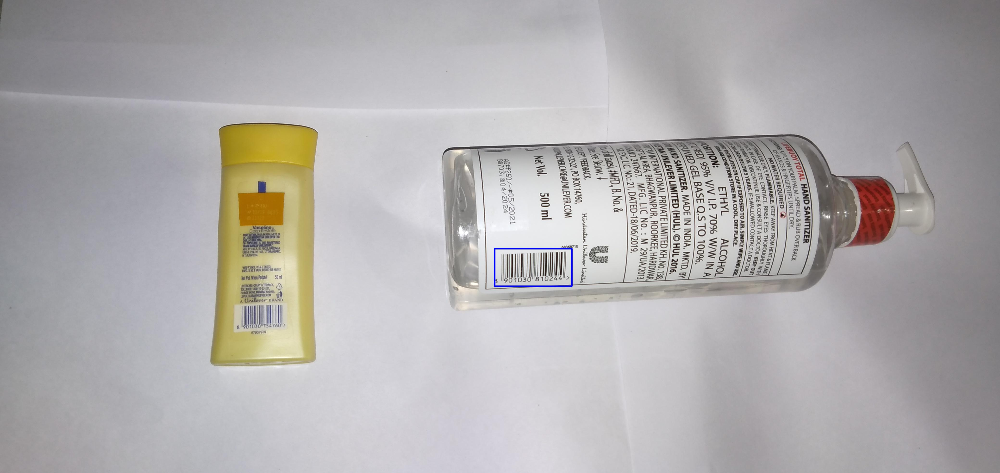
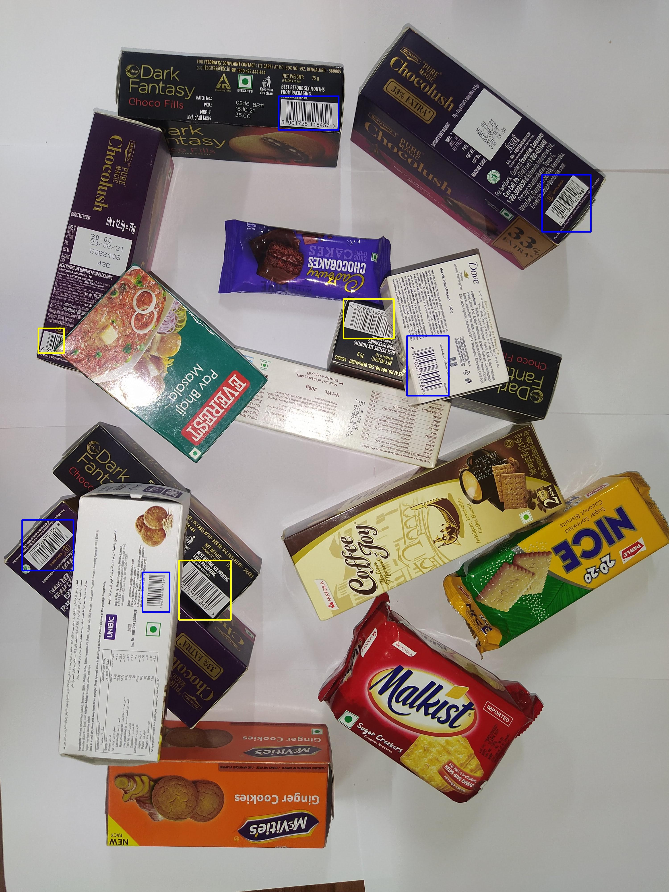

# Barcode Decode and Detect

This repository demonstrates barcode detection and decoding using both rule-based approaches with OpenCV and pyzbar, as well as deep learning methods with Mask-RCNN instance segmentation using the detectron2 framework.

## Dataset

- The dataset used for training the deep learning model consists of 12-14 annotated images tailored to the project's requirements.
- Additional images are included for testing and validation.

[Dataset Link](https://drive.google.com/drive/folders/1bxoRNTp0St4h9tVkJSNQTb0ItwUYKbEo?usp=sharing)

## Results

- Results of the detection and decoding are available in the following Google Drive folder:
  [Results](https://drive.google.com/drive/folders/1t6DE7tzg4OBtJyEK4AAcWFD3P6CiTgTj?usp=sharing)

To explore the code and detailed explanation, switch to the project directory:

```bash
cd {Directory name}
```

## Rule Based Approach

A rule-based approach using OpenCV and pyzbar is implemented with hard-coded kernel functions.

- [Rule Based Approach Repository](https://github.com/BytefulRashi/BarDetectDecode/tree/main/Barcode-Detection-and-Decoding)




## Deep Learning Approach

For deep learning-based detection, Mask-RCNN instance segmentation model is employed using detectron2.

### MRCNN No Barcode

- Detects objects without visible barcodes and outlines them with red bounding boxes.

- [MRCNN No Barcode Repository](https://github.com/BytefulRashi/BarDetectDecode/tree/main/MRCNN%20No%20Barcode)




### Bounding Box Around All Objects

- Detects all objects and draws black bounding boxes around them.

- [Bounding Box Around All Object Repository](https://github.com/BytefulRashi/BarDetectDecode/tree/main/Bouding-Box-Around-All-Object)




### MRCNN Complete or Partial Barcode

- Draws blue bounding boxes around complete visible barcodes and yellow bounding boxes otherwise.

- [MRCNN Complete or Partial Barcode Repository](https://github.com/BytefulRashi/BarDetectDecode/tree/main/MRCNN-Complete-Or-Partial-Barcode)




## Result Analysis

Given the small dataset size (10-12 images per case), the results indicate potential overfitting. To improve the model's performance, consider the following actions:

- Increase the size and diversity of the dataset.
- Apply data augmentation techniques to enhance generalization.
- Experiment with alternative deep learning models suited for barcode detection.

Pretrained models for barcode detection were considered but avoided due to dataset mismatch with the provided dataset.
